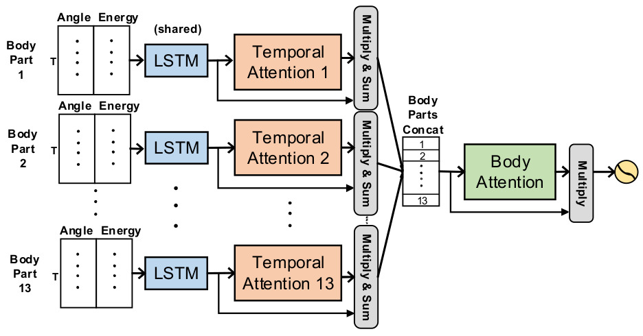
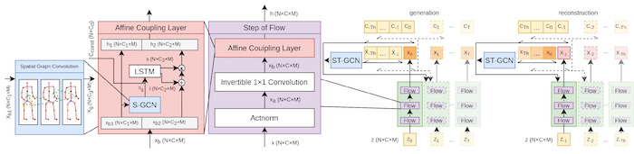

# EnTimeMent - EU Horizon 2020 FET PROACTIVE project (2019-2022)
ENtrainment & synchronization at multiple TIME scales in the MENTal foundations of expressive gesture

### Software libraries for the study of the origin of movement [[link](https://github.com/EnTimeMent/Origin-of-Movement)]

The software, written in Matlab, extracts movement features (speed, tangential acceleration, kinetic energy, angular momentum) for two skeleton models of the human body, which refer to two different spatial scales. Then, such features are filtered and combined to compute a dissimilarity measure for the joints, from which a transferable utility game on an auxiliary graph is constructed. Finally, the vector of Shapley values for that game is computed (for the case in which the Shapley value coincides with the weighted degree centrality) and normalized with respect to the maximum Shapley value. The software allows for the possibility of computing the Kendall correlation between different rankings of joints. Further comments can be found inside the code.

### Software libraries for the analysis of qualities of movement [[link](https://github.com/EnTimeMent/Analysis-Qualities-of-Movement)]

The purpose of this software is to analyseMotion Capture data in order to calculate the joint with the maximum Shapley Value, separately for three motion features (speed, acceleration and angular momentum). The software models the human body as a weighted undirected graph, and calculates the importance of each joint in movement. A Lowpass Butterworth filter is used on the data for cleaning and processing. Each movement feature is calculated separately for each frame of each MoCap segment. Spectral clustering on the weighted graph is applied, to compute for each frame the Shapley Values of all the joints for all the movement features. It is a mixture of Python (for the data processing, filtering, motion feature calculation and results analysis) and MATLAB (for the creation of the body as a graph andfor the Shapley Value calculation).

### Synchronization among temporal scales: the MECS algorithm [[link](https://github.com/EnTimeMent/MECS-Algorithm)]

Event Synchronization analysis was originally conceived for providing a simple and robust method to measure synchronization between two time series. This algorithm, however,and those developed as extensions thereof do not directly deal with multiple temporal scales.We extended the state-of-the-art of Event Synchronization techniquesby conceivingMulti-Event-Class Synchronization (MECS). MECS measures synchronization between events -belonging to different event classes -that are detected in multiple time series. MECS can compute synchronization between events belonging to the same class (intra-class synchronization) or to different classes (inter-class synchronization). Our technique can deal with macro-events, i.e., aggregations of events that enable analysis at multiple temporal scales.

Publication: *Volpe, G., Alborno, A., Mancini M., and Niewiadomski, R., Multi-Event-Class Synchronization (in preparation).*

### BANet machine learning architectures [[link](https://github.com/EnTimeMent/BANet)]

Neural network architectures designed for automatic detection of affective behaviour from motion capture data. Detailed description of the architecture can be found in the associated publication: 

*Wang, Chongyang, Min Peng, Temitayo A. Olugbade, Nicholas D. Lane, Amanda C. De C. Williams, and Nadia Bianchi-Berthouze. "[Learning temporal and bodily attention in protective movement behavior detection.](https://ieeexplore.ieee.org/abstract/document/8925084/)" In 8th International Conference on Affective Computing and Intelligent Interaction Workshops and Demos(ACIIW), pp. 324-330. IEEE, 2019.*

### P(l)aying Attention sonification application [[link](https://github.com/EnTimeMent/Playing-Attention)]

Application designed for sonification of motion capture data with respect to BAnet neural network attention weights for affectiveb ehaviour recognition from the motion capture data. Detailed description of the application can be found in the associated publication: 

*Gold, Nicolas E., Chongyang Wang, Temitayo Olugbade, N. Berthouze, and A. Williams. "[P(l)aying Attention: Multi-Modal, Multi-Temporal Music Control.](https://www.nime.org/proceedings/2020/nime2020_paper33.pdf)" In Proceedings of the International Conference on New Interfaces for Musical Expression (NIME) 2020.*

### Hierarchical HAR-PBD machine learning architectures [[link](https://github.com/EnTimeMent/Hierarchical_HAR-PBD)]

Neural network architectures designed for continuousdetection of affective behaviour from motion capture and muscle activity data.Detailed description of the Hierarchical HAR-PBD v1 architecture can be found in the associated publication: 

*Wang, Chongyang, Yuan Gao, Akhil Mathur, Amanda C. De C. Williams, Nicholas D. Lane, and Nadia Bianchi-Berthouze. "Leveraging activity recognition to enable protective behavior detection in continuous data." In Proceedings of the ACM on Interactive, Mobile, Wearable and Ubiquitous Technologies5, no. 2 (2021): 1-27.*

### MiMT machine learning architecture [[link](https://github.com/EnTimeMent/MiMT)]

Neural network architecture designed for automatic detection of affective behaviour at multiple timescales based on motion capture data. Detailed description of the architecture can be found in the associated publication: 

*Olugbade, Temitayo, Nicolas Gold, Amanda C. de C. Williams, and Nadia Bianchi-Berthouze. "A Movement in Multiple Time Neural Network for Automatic Detection of Pain Behaviour." In Companion Publication of the 2020 International Conference on Multimodal Interaction, pp. 442-445. 2020.*

### huSync: Human Pose Estimation Architecture for computing Dyadic Synchronization [[link](https://github.com/EnTimeMent/huSync-DyadicSynchronization)]

This repository contains python code to compute Dyadic Synchronization between co-performers in a small group of musicians. You will find two files:
* Module_DataExtraction: After having used AlphaPose on the video-dataset, we proceed with using this file toextract the data for each performer by isolating them individually. It stores the output as a .csv file
* Module_DyadicSynchronization: This file contains the code that extracts the data from the .csv file processed and provides the Dyadic Synchronization between all possible pairs in a musical ensemble.

Both files are shared as a jupyter notebooks since this should make it easier to execute the code with more control. The added control helps perform experiments carefully, particularly since the data from pose estimation algorithms can be noisy and sometimes requires manual intervention.

*Sabharwal, S., Keller, P., Varlet, M., Camurri, A., Volpe, G.(2022). huSync: A novel computational approach to quantify synchronization using poseestimation algorithms - A case study assessing the effects of leadership and task structure in musical group interaction. Manuscript in preparation*

### Raga Pose Estimation [[link](https://github.com/DurhamARC/raga-pose-estimation)]

This repository comprises a Colab script an associated python library to support the use of pose estimation algorithms with video recordings of Indian music performances. Post-processing options include the selection of data points, interpolation of missing data and smoothing. The repository forms part of a Open Science Framework corpus alongside input videos, saved pose estimation data and output overlaid (video plus skeleton) videos. See: 

* *Clayton, M., Li, J., Clarke, A. R., Weinzierl, M., Leante, L. & Tarsitani, S. (2021). "[Hindustani raga and singer classification using pose estimation.](https://doi.org/10.17605/OSF.IO/T5BWA)" OSF. October 14.* , 
* *M., Li, J., Clarke, A. R., and Weinzierl, M. (in submission). "Hindustani raga and singer classification using 2D and 3D pose estimation from video recordings."*

### Group behavior recognition using attention-and graph-based neural networks [[link](https://github.com/EnTimeMent/Group-Behavior-Recognition)]

This repository contains Python code for analysing group behaviours in the case of conversational groups, where an approaching participant is trying to engage in an already ongoing discussion in a group with three members. From the analysis it is predicted whether the group will either include or disregard the newcomer. Two different kinds of neural network-based models are included as part of the code, one based on attention networks and another based on multi-spatial-temporal graph convolution networks. See:

*Yang, F., Yin, W., Inamura, T., Björkman, M., Peters, C., "Group behavior recognition using attention-and graph-based neural networks", ECAI 2020.*

### Impact of trajectory generation methods for robot approaching group behaviors [[link](https://github.com/EnTimeMent/Impact-of-Trajectory-Generation-Methods)]

This repository containsPython code for studying how the choice of robot trajectory generation methods impacts viewer perception whena robot tries to engage in an ongoing discussion between three human members in a group. It includes a procedural model, which is used as a baseline, as well as a learned model based on imitation learning with graph convolution networks, a model with which the robot tries to mimic previously observed successful human approach behaviours. See:

*Yang, F., Yin, W., Björkman, M., Peters, C., "Impact of trajectory generation methods on viewer perception of robot approaching group behaviors", RO-MAN 2020.*

 
 

### Graph-based Normalizing Flow for Human Motion Generation and Reconstruction [[link](https://github.com/EnTimeMent/Graph-Generative-Flow)]

We use a spatial convolutional network in the affine coupling layer to extract skeleton features. The conditioning information include the past poses. All these are concatenated as one vector in MoGlow. We use a spatial temporal convolution networks to extract the features of past sequence. To reconstruct the missing data, we first generate future poses, then reverse the generated poses and control signals. Regarding the reversed sequences as control information to generate markers to fill the holes of the missing data.

*Yin, W., Yin, H., Kragic, D., Björkman, M., "[Graph-based Normalizing Flow for Human Motion Generation and Reconstruction](https://ui.adsabs.harvard.edu/abs/2021arXiv210403020Y/abstract)", RO-MAN 2021.*

### EmoSync: human multi-scale group synchronisationduring mirror game of four people [[link](https://github.com/EnTimeMent/EMOSYNC_Behavioural_sync), [link](https://github.com/EnTimeMent/EMOSYNC_EyeGaze)]

This repository contains Matlab code for the analysis of triad mirror game, with upper arm improvisation movement of three agents standing in a triangular typology. The first repository looks at analysis of behavioural synchronisation metrics based on the optical marker data recordings (“dancing arm”) and the second repository looks at the gaze behaviour (based on the optical marker data recordings of the head position of the agents). Part of the code includes pipeline to extract synchronisation metrics (order parameter) from similar dataset, developed by Dr. Carmela Calabrese and published as:

*Bardy, B.G., Calabrese, C., De Lellis, P. et al. "[Moving in unison after perceptual interruption.](https://www.nature.com/articles/s41598-020-74914-z)" Sci Rep 10, 18032 (2020).*

### Spook’n’play: impact of acoustic, emotion-laden stimuli on disembodiedgroup synchronisation [[link](https://github.com/EnTimeMent/Spook-and-Play)]

This repository contains Matlab code for the analysis of synchronisation metrics (order parameter, level of sychronisation, time to reach synchronisation, time in synchronisation) and main kinematic features (movement cycle duration, frequency, number of cycles)in a disembodied mirror game for multiple human players. In this study participants coordinated their index finger movement in a cycling motion with other players using Chronos interface (see for more [information](https://dibernardogroup.github.io/Chronos/about_us.html)). During this task, all players were induced with acoustic, emotional stimuli pre-selected from [IADS-2 battery](https://csea.phhp.ufl.edu/media/iadsmessage.html) to observe the impact on their individual motor behaviour and consequently group performance. Part of the code includes pipeline toextract synchronisation metrics from similar dataset, developed by Dr. Carmela Calabrese and published as:

*Bardy, B.G.,Calabrese, C., De Lellis, P. et al. "[Moving in unison after perceptual interruption](https://doi.org/10.1038/s41598-020-74914-z)". Sci Rep 10, 18032 (2020).*

### Ball Exchange: The Importance of Multiple Temporal Scales in Motion Recognition: when Shallow Model can Support Deep Multi Scale Models [[link](https://github.com/EnTimeMent/Ball-Exchange/)]

This repository contains Python code for the analysis of human movement in dyad actions where two people exchange a ball of different weights (light and heavy) with different intentions (fair, aggressive, and deceptive).The scope is to automatically detect, just based on Mocap data, what is:

* The weight of the ball, i.e., light or heavy;
* The intention of the ball exchange, i.e., fair aggressive, or deceptive

Part of the code includes the algorithms tested in the analysis;the preprocessing techniques followed.

*D’Amato, V., Oneto, L., Camurri, A., Anguita, D. et al. (in submission) "The Importance of Multiple Temporal Scales in Motion Recognition: when Shallow Model can Support Deep Multi Scale Models.", (2021).*

### Ellipses: The Importance of Multiple Temporal Scales in Motion Recognition: from Shallow to Deep Multi Scale Models [[link](https://github.com/EnTimeMent/Ellipses)]

This repository contains Python code for the analysis of human movement in individual actions where people draw an ellipse under different conditions (speeds and hands).The scope is to automatically detect, just based on graphics tablet data, the person who drawn an ellipse. Part of the code includes the algorithms tested in the analysis; the preprocessing techniques followed.

*D’Amato, V., Oneto, L., Camurri, A., Anguita, D., Zarandi, Z., Fadiga, L., D’Ausilio, A., Pozzo, T.. et al. (in submission) "The Importance of Multiple Temporal Scales in Motion Recognition: from Shallow to Deep Multi Scale Models." (2021).*
